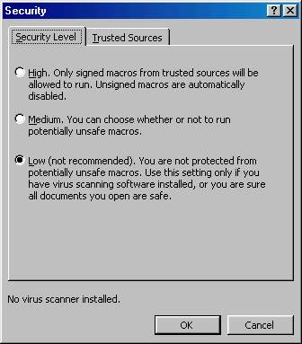



## Macro Security Level For MS Office

### Description

From 2 years, I made some macros in PowerPoint, and I want my

project to be puplic and easy to use, but there was a problem

I faced, it was the secuirity level which I want it to be low

to make my project work smoothly, sppecially if we know that

Norton antivirus make secuirity to high, so user can't feel

if there was any macro.

So I use this program attached, and put it in the startup of

the CD, so it work directly when put the CD to adjust security

level to low.

You can check its work from Word or powerpoint select tool

menu then macro, finally security to check the level, then

close the program (Don't forget that) and run our program

and test it like above.

Note that: I test the program for Office2000 &amp; OfficeXP
 
### More Info
 

             |
---                |---
**Submitted On**   |2004-08-31 19:42:24
**By**             |[Armia M\. Salib](https://github.com/Planet-Source-Code/PSCIndex/blob/master/ByAuthor/armia-m-salib.md)
**Level**          |Intermediate
**User Rating**    |5.0 (10 globes from 2 users)
**Compatibility**  |VB 6\.0, VB Script, VBA MS Access, VBA MS Excel
**Category**       |[Registry](https://github.com/Planet-Source-Code/PSCIndex/blob/master/ByCategory/registry__1-36.md)
**World**          |[Visual Basic](https://github.com/Planet-Source-Code/PSCIndex/blob/master/ByWorld/visual-basic.md)
**Archive File**   |[Macro\_Secu201154862006\.zip](https://github.com/Planet-Source-Code/armia-m-salib-macro-security-level-for-ms-office__1-66201/archive/master.zip)

